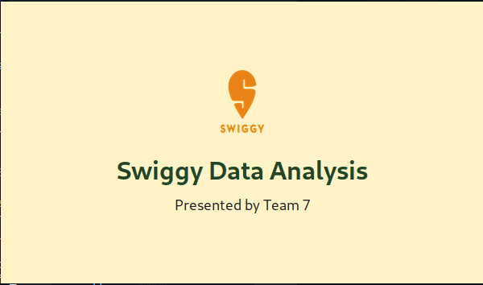
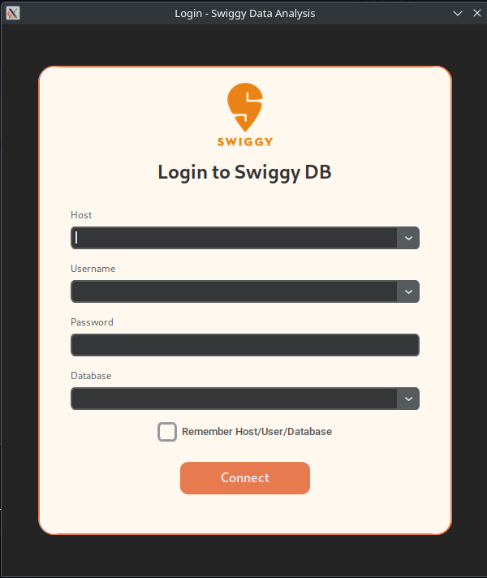
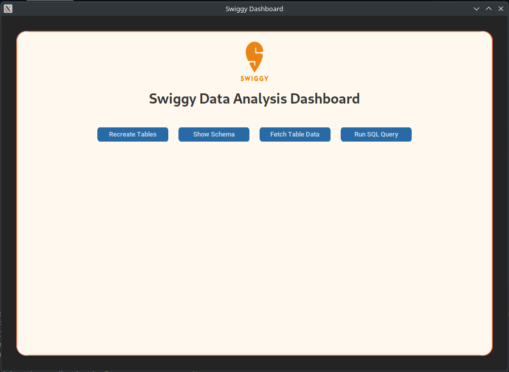
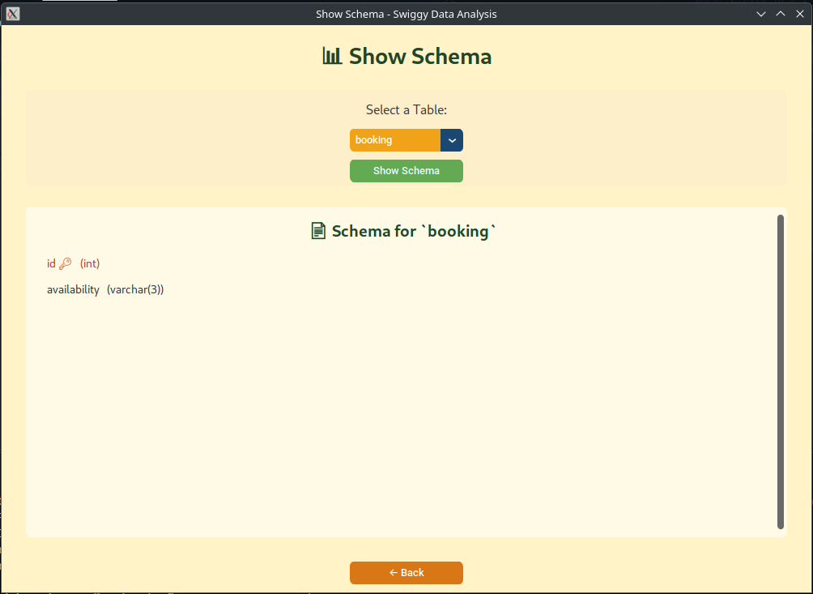
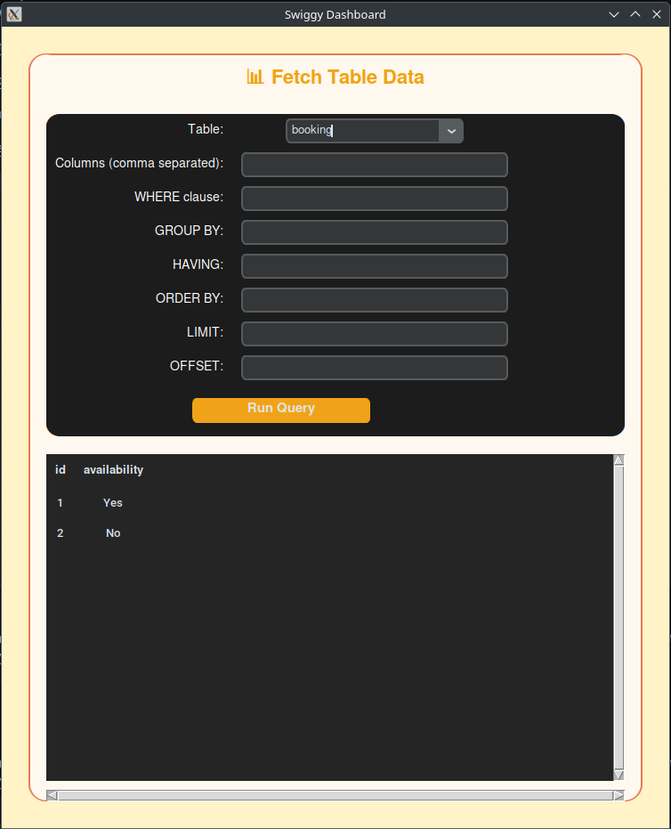
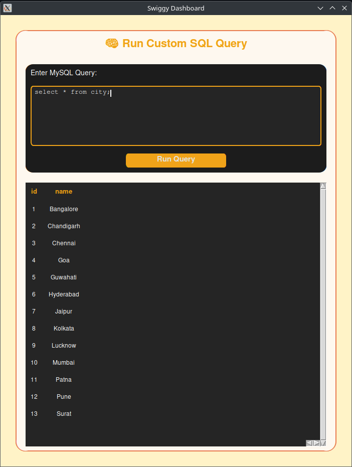

# Swiggy-Analysis-with-Python

Executing MySQL queries using python and using tkinter to make a functionong UI

### Splash Screen

### Login Page

### Swiggy Data Analysis Dashboard

### Show Schema Page

### Fetch Table Data Page

### Run Custom SQL Query

