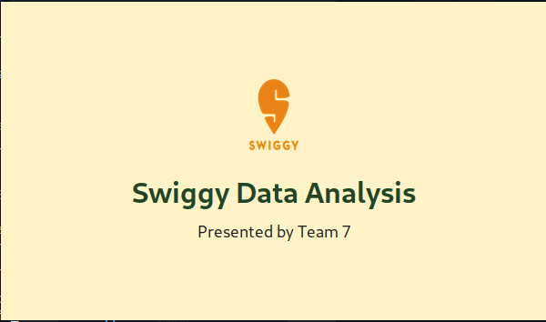
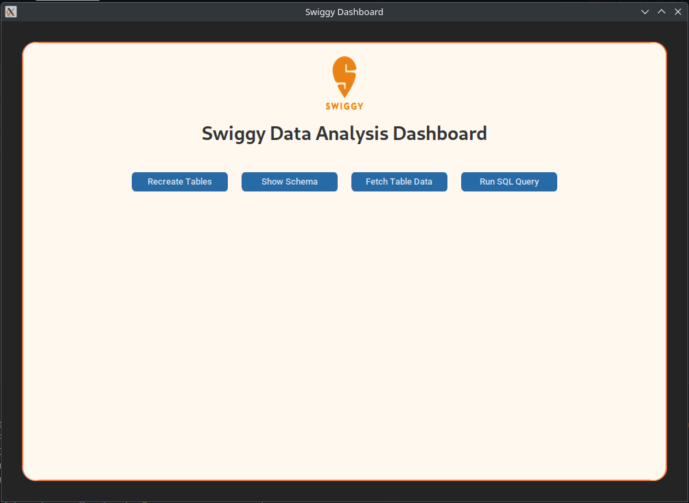
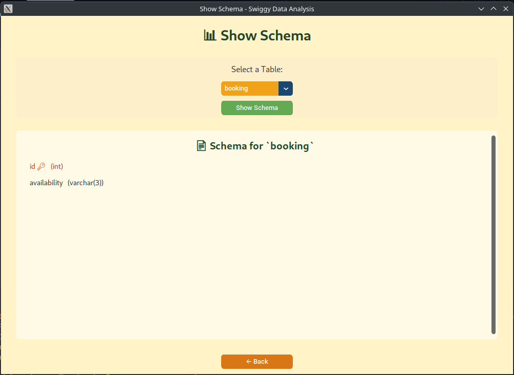
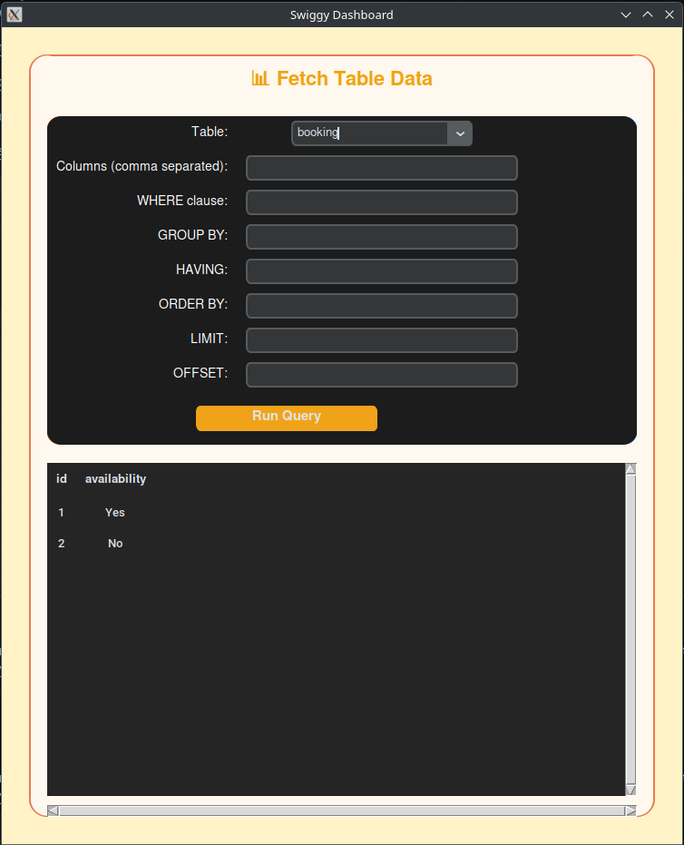
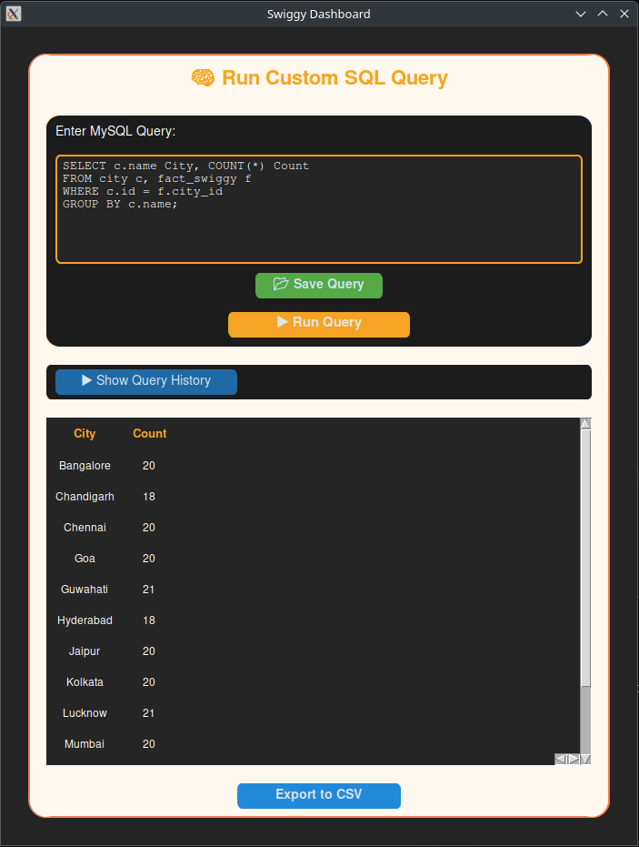
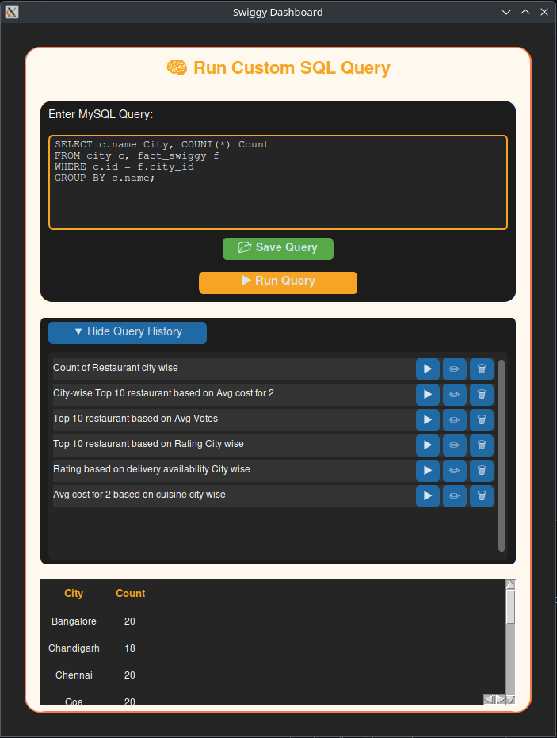

# Swiggy Analysis with Python 🛵📊

A full-fledged Swiggy data analysis application built with Python and MySQL, featuring a modern GUI using `CTkinter`. This project enables interactive data visualization and insights generation from restaurant data sourced from Swiggy.

---

## 🚀 Features

- ✅ **Login & Authentication System**
- 📊 **Interactive GUI** using `CTkinter` with Swiggy-themed design
- 🗂️ **Database Integration** with MySQL for seamless data management
- 🔍 **Query Executor** with output display
- 🧾 **Schema Visualization** to explore tables and relationships
- 💾 Load initial data from CSV
- 🖼️ **Splash Screen & Screensaver** with engaging UI/UX

---


## Screenshots

### Splash Screen



### Login Page


### Swiggy Data Analysis Dashboard



### Show Schema Page



### Fetch Table Data Page



### Run Custom SQL Query



### Saved Queries




---

## 📁 Project Structure


    Swiggy-Analysis-with-Python/
    ├── db/
    │   └── db_connection.py
    ├── assets/
    │   └── swiggy.png
    │   └── screenshots/
    │       └── splash_screen.png
    │       └── login_screen.png
    │       └── swiggy_data_analysis_dashboard.png
    │       └── show_schema_page.png
    │       └── fetch_table_data_page.png
    │       └── custom_query.png
    │       └── saved_query.png
    ├── app/
    │   ├── app.py
    │   └── credentials/
    │       └── credentials.json
    ├── data/
    │   └── Swiggy_Analysis_Source_File.csv
    ├── notebooks/
    │   └── swiggy_db.ipynb
    ├── queries/
    │   └── query_history.json
    ├── requirements.txt
    ├── setup.sh
    └── README.md

---

## ⚙️ Setup Instructions

1. **Clone the repository**
   ```bash
   git clone https://github.com/YOUR_USERNAME/Swiggy-Analysis-with-Python.git
   cd Swiggy-Analysis-with-Python

2. **Create a virtual environment (recommended)**
   ```bash
   python -m venv venv
   source venv/bin/activate  # Linux/macOS
   venv\Scripts\activate     # Windows

3. **Install dependencies**
   ```bash
   pip install -r requirements.txt

4. **Configure the database**

* Update the MySQL credentials in db_connection.py
* Run provided SQL scripts (if any) to populate tables

5. **Run the application**
   ```bash
   python app/app.py

## 🧪 Modules Breakdown

| Module/File                            | Description                                                                                                                                    |
| -------------------------------------- | ---------------------------------------------------------------------------------------------------------------------------------------------- |
| `db/db_connection.py`                  | Contains the `SwiggyDBConnection` class for connecting to MySQL, initializing tables, executing SQL queries, and managing connections.         |
| `app/app.py`                           | Contains the `SwiggyApp` class, responsible for building the CTkinter GUI, managing user interface transitions, and integrating backend logic. |
| `data/Swiggy_Analysis_Source_File.csv` | Initial dataset used for populating the database during setup.                                                                                 |
| `notebooks/swiggy_db.ipynb`            | Jupyter notebook for exploratory data analysis and testing SQL queries during development.                                                     |
| `assets/screenshots/`                  | Folder containing UI screenshots used in the README.                                                                                           |


## 🎯 Use Cases
* Students practicing database integration with GUI
* Data visualization enthusiasts interested in real-world restaurant data
* Learners exploring Python + MySQL desktop applications

## 📝 To-Do / Improvements
* Add graph visualizations (matplotlib/seaborn)
* Add export options for PDF/Excel
* Add dark/light theme toggle
* Include animated transitions and hover effects

